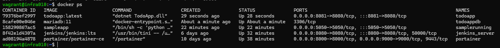
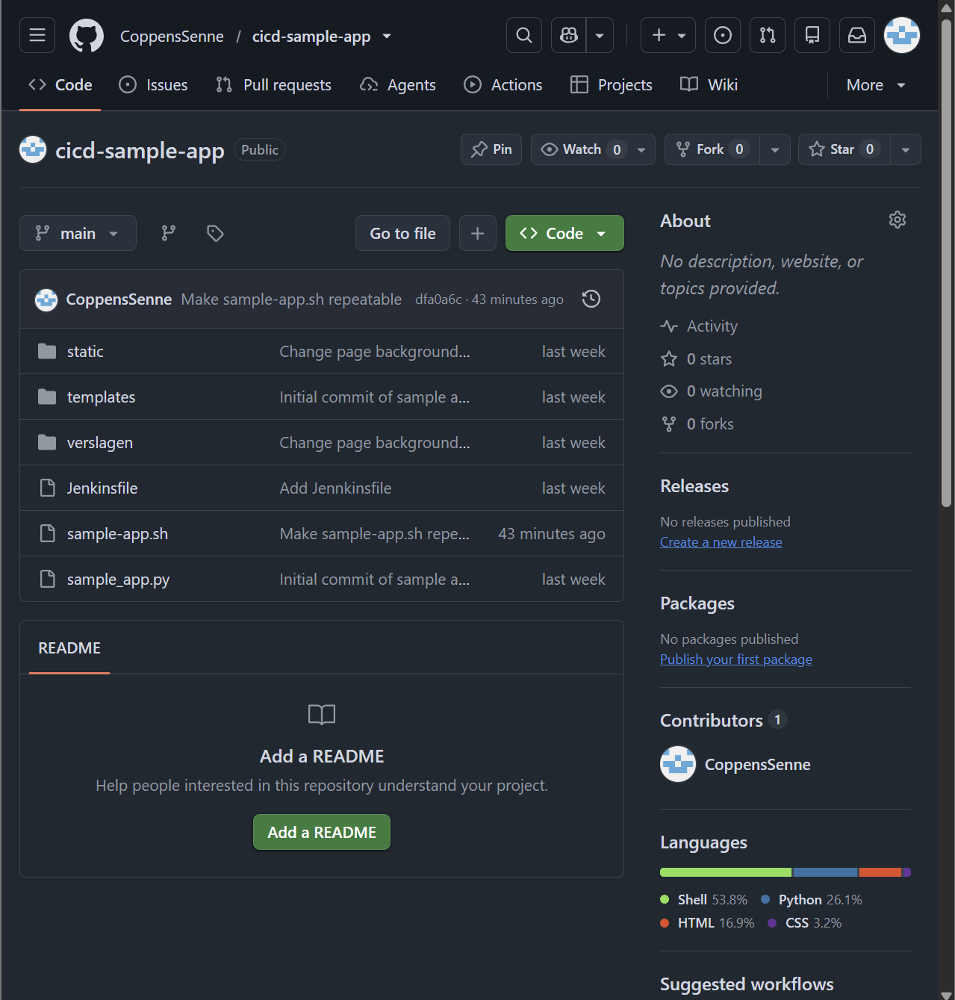
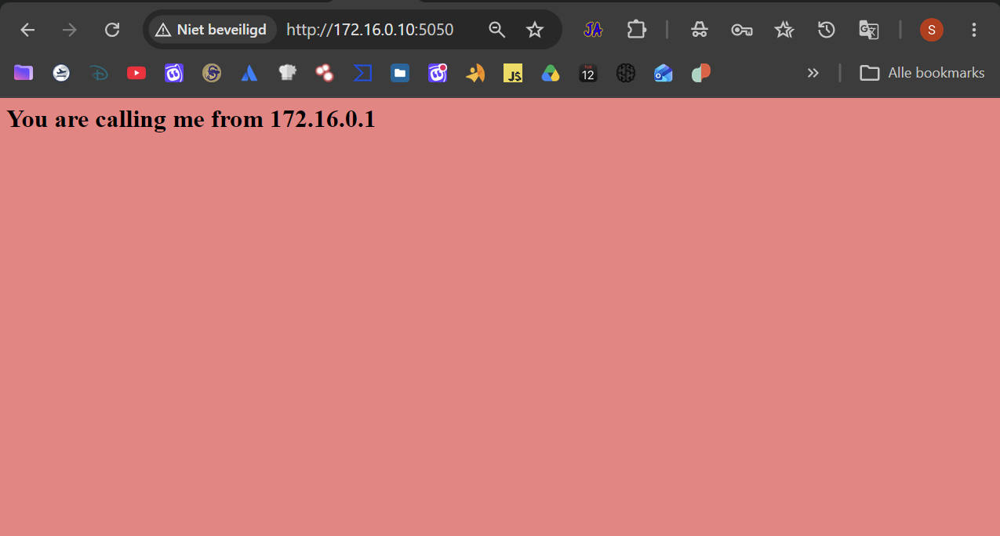
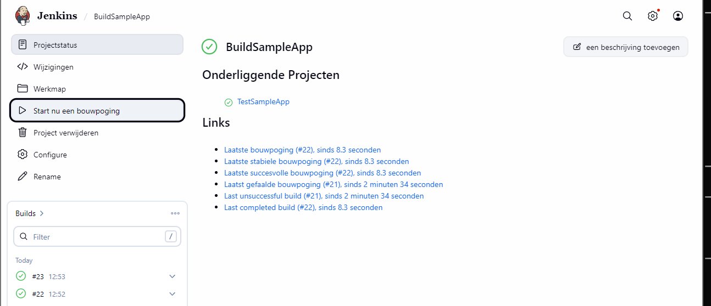
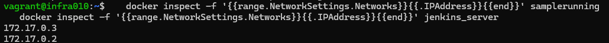
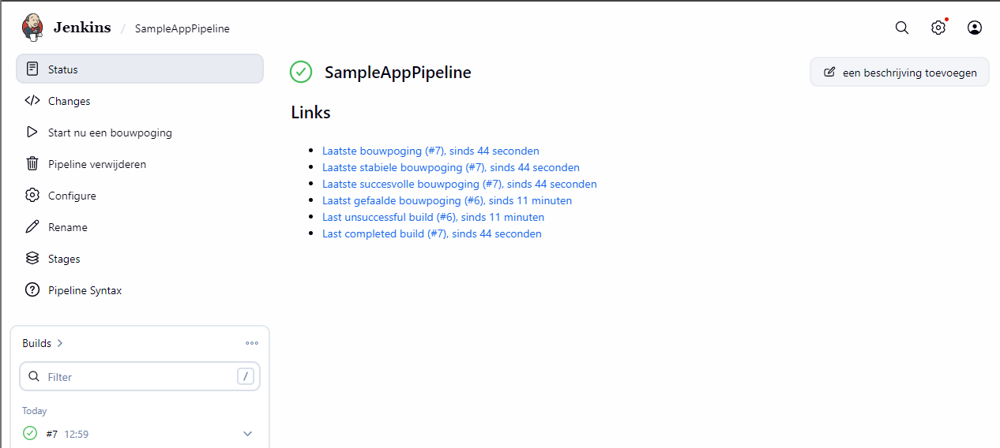
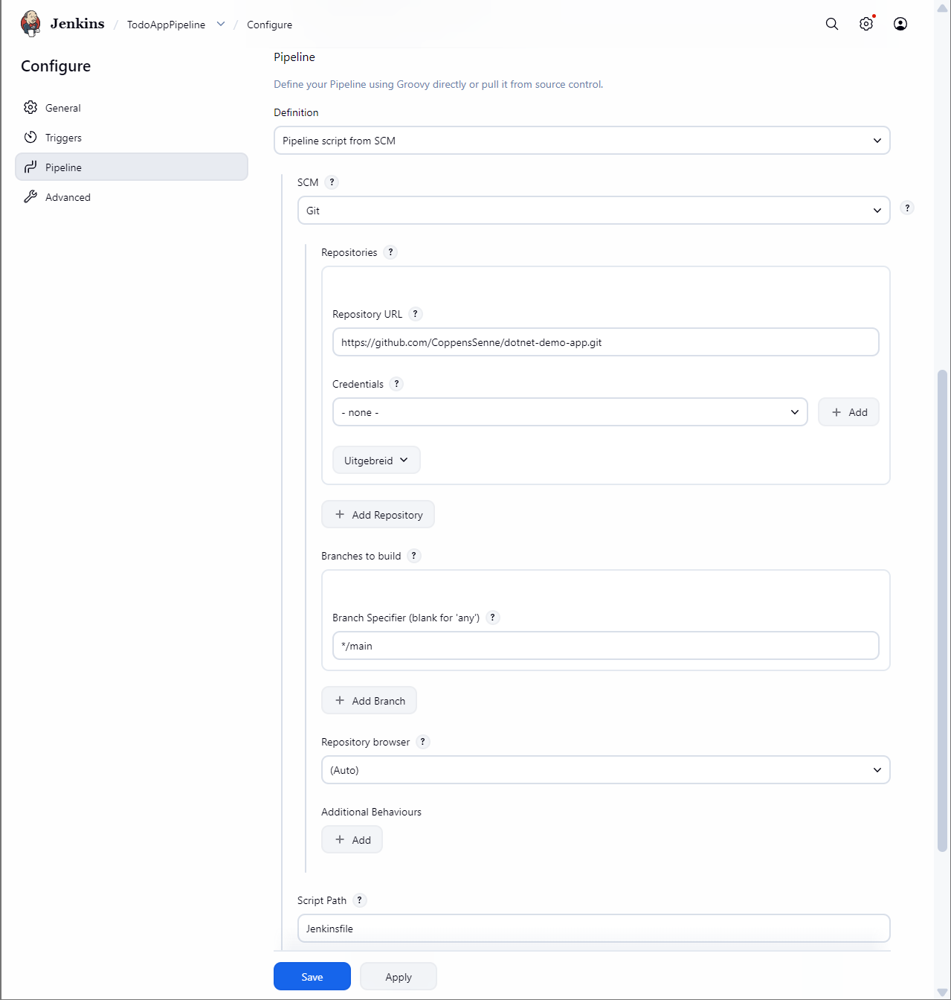
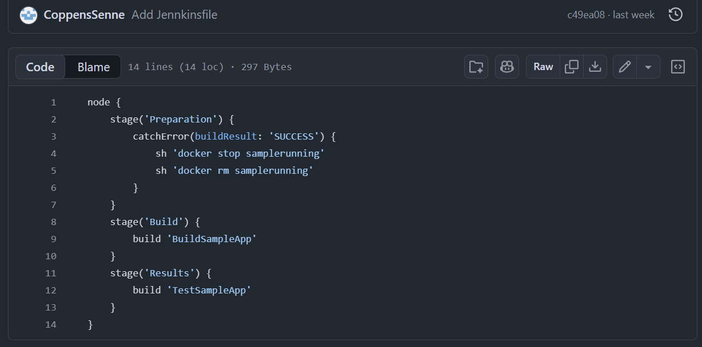
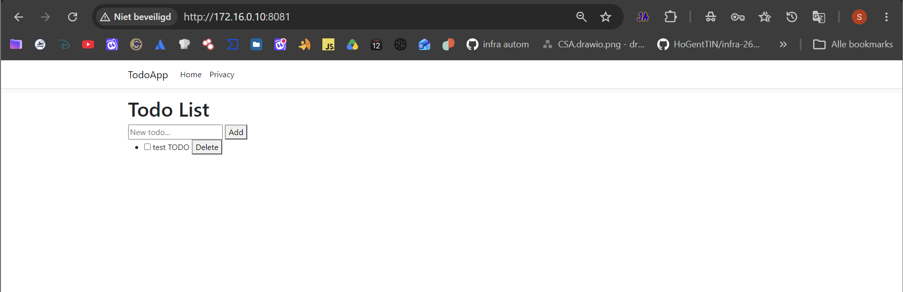
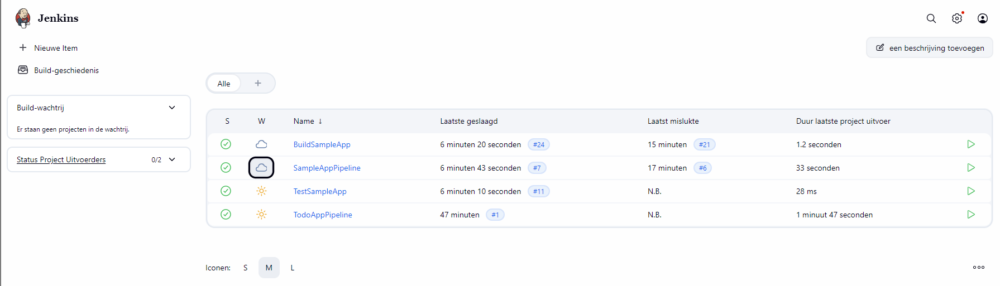

 # labo 1 

## Checklist beoordeling
 
- [x] GitHub-repo sample app en .Net-app getoond
- [x] Beide apps draaien in de browser
- [x] Jenkins-dashboard met alle jobs
- [x] Wijziging gemaakt, gecommit en gepusht
- [x] Pipeline gestart en wijziging zichtbaar in de browser
- [x] Je kunt je setup uitleggen
- [x] Verslag en cheat sheet met screenshots en console-output


## Inhoud
 
1. [Wachtwoorden en omgeving](#1-wachtwoorden-en-omgeving)
2. [Repository sample app](#2-repository-sample-app)
3. [Jenkins starten](#3-jenkins-starten)
4. [BuildSampleApp](#4-buildsampleapp)
5. [TestSampleApp](#5-testsampleapp)
6. [Pipeline](#6-pipeline)
7. [Jenkinsfile](#7-jenkinsfile)
8. [Wijziging doorvoeren](#8-wijziging-doorvoeren)
9. [.Net-applicatie](#9-net-applicatie)
10. [Overzicht Jenkins-dashboard](#10-overzicht-jenkins-dashboard)
11. [Cheat sheet](#11-cheat-sheet)

---


## Wachtwoorden en omgeving
| User/account | Password |
| ------------ | -------- |
| admin        | Administrator2026! |
| Jenkins (initieel wachtwoord) | 25d61ea929f34276bf3ab86858daefe2 |

**Omgeving**
 
| Onderdeel | Waarde |
| --------- | ------ |
| Jenkins | http://172.16.0.10:8080/ |
| Portainer | http://172.16.0.10:9000/ |
| Sample app | http://172.16.0.10:5050/ |
| Todo-app (.Net) | http://172.16.0.10:8081/ |




## Repository sample app
De starter code gekopieerd naar een map buiten de cursus-repo en gepusht naar GitHub:
https://github.com/CoppensSenne/cicd-sample-app
 
```bash
cd ~/cicd-sample-app
git init
git add .
git commit -m "Initial commit of sample application"
git branch -M main
git remote add origin git@github.com:CoppensSenne/cicd-sample-app.git
git push -u origin main
```


## 3. Jenkins starten
 
Als de container al bestaat:
 
```bash
docker start jenkins_server
```
 
Als hij nog niet bestaat:
 
```bash
docker run -p 8080:8080 -u root -v jenkins-data:/var/jenkins_home -v $(which docker):/usr/bin/docker -v /var/run/docker.sock:/var/run/docker.sock -v "$HOME":/home --name jenkins_server jenkins/jenkins:lts
```
Uitleg: de Docker-socket wordt gemount zodat Jenkins Docker-commando's op de host kan uitvoeren. Daardoor draait de sample app naast Jenkins en niet erin. Het volume `jenkins-data` bewaart de configuratie.

## 4. BuildSampleApp
 
Freestyle project:
 
- Git URL: `https://github.com/CoppensSenne/cicd-sample-app.git`
- Branch: `*/main`
- Build step (Execute shell): `bash ./sample-app.sh`


 
### Fout 1: tempdir bestaat al
 
```
mkdir: cannot create directory 'tempdir': File exists
```
Oorzaak: de workspace wordt niet opgeruimd, dus `tempdir` bestaat nog van de vorige build.
 
Oplossing (eenmalig):
 
```bash
docker exec jenkins_server rm -rf /var/jenkins_home/workspace/BuildSampleApp/tempdir
```
 
### Fout 2: containernaam bestaat al
 
```
docker: Error response from daemon: Conflict. The container name "/samplerunning" is already in use
```
 
Oorzaak: `samplerunning` draait nog van de vorige build.
 
Oplossing (eenmalig):
 
```bash
docker stop samplerunning
docker rm samplerunning
```
 
### Blijvende oplossing in sample-app.sh
 
```bash
rm -rf tempdir
mkdir tempdir
...
docker stop samplerunning || true
docker rm samplerunning || true
```
 
Zo werkt het script bij elke build (idempotent). Pushen naar GitHub is nodig, want Jenkins haalt de code daar op.
 


## 5. TestSampleApp
 
IP's opzoeken:
 
```bash
docker inspect -f '{{range.NetworkSettings.Networks}}{{.IPAddress}}{{end}}' samplerunning
docker inspect -f '{{range.NetworkSettings.Networks}}{{.IPAddress}}{{end}}' jenkins_server
```


## 6. Pipeline
 
Pipeline-job `SampleAppPipeline`:
 
```groovy
node {
    stage('Preparation') {
        catchError(buildResult: 'SUCCESS') {
            sh 'docker stop samplerunning'
            sh 'docker rm samplerunning'
        }
    }
    stage('Build') {
        build 'BuildSampleApp'
    }
    stage('Results') {
        build 'TestSampleApp'
    }
}
```
 
Stages: oude container opruimen, bouwen, testen.
 



## 7. Jenkinsfile
 
Zelfde code in een bestand `Jenkinsfile`  in de root van de repo:
 
```bash
git add Jenkinsfile
git commit -m "Add Jenkinsfile"
git push origin main
```
Voordeel: de pipeline staat als code in Git bij de applicatie.
 




## 8. Wijziging doorvoeren
 
`static/style.css`: achtergrondkleur van `lightsteelblue` naar `lightcoral`.
 
```bash
git add .
git commit -m "Change background color"
git push origin main
```
 
Pipeline gestart en browser herladen.
 

## 9. .Net-applicatie
 
Todo-app met MariaDB. Fork: https://github.com/CoppensSenne/dotnet-demo-app
 
Wat ik uit de repo haalde:
 
- Twee containers: database (`todoappdb`, `mariadb:11`) en webapp (`todoapp`).
- De app luistert op 8080, maar dat is Jenkins. Daarom publiceer ik op **8081**.
- Jenkins heeft geen `docker compose`, dus gewone `docker`-commando's in het Jenkinsfile.
Jenkinsfile (root van de fork):
 
```groovy
node {
    stage('Checkout') {
        checkout scm
    }
    stage('Preparation') {
        sh 'docker network create todo-net || true'
        sh 'docker network connect todo-net jenkins_server || true'
        sh 'docker stop todoapp || true'
        sh 'docker rm todoapp || true'
    }
    stage('Database') {
        sh '''
        if [ -z "$(docker ps -aq -f name=^todoappdb$)" ]; then
          docker run -d --name todoappdb --network todo-net \
            -e MARIADB_ROOT_PASSWORD=sekrit \
            -e MARIADB_DATABASE=todo_db \
            -e MARIADB_USER=todo_usr \
            -e MARIADB_PASSWORD=letmeinplz \
            -v todoapp-db-data:/var/lib/mysql \
            mariadb:11
        else
          docker start todoappdb || true
        fi
        for i in $(seq 1 30); do
          docker exec todoappdb healthcheck.sh --connect --innodb_initialized && break
          sleep 2
        done
        docker exec -i todoappdb mariadb -utodo_usr -pletmeinplz todo_db < TodoApp/schema.sql || true
        '''
    }
    stage('Build') {
        sh 'docker build -t todoapp:latest TodoApp'
    }
    stage('Deploy') {
        sh '''
        docker run -d --name todoapp --network todo-net -p 8081:8080 \
          -e "ConnectionStrings__TodoDb=Server=todoappdb;Port=3306;Database=todo_db;User=todo_usr;Password=letmeinplz;" \
          -e ASPNETCORE_ENVIRONMENT=Development \
          todoapp:latest
        '''
    }
    stage('Test') {
        sh '''
        for i in $(seq 1 20); do
          curl -sf http://todoapp:8080/ > /dev/null && echo "App OK" && exit 0
          sleep 3
        done
        echo "App reageert niet"
        exit 1
        '''
    }
}
```
 
Uitleg:
 
- Eigen netwerk `todo-net`: app en database vinden elkaar via de naam `todoappdb`.
- Jenkins zit ook op dat netwerk, zodat de test `http://todoapp:8080/` kan bereiken.
- De database heeft een volume, dus todo's blijven bestaan. Enkel de app wordt vervangen.
- Het .NET-SDK staat niet in Jenkins; `docker build` bouwt de app.
Jenkins: Pipeline `TodoAppPipeline`, *Pipeline script from SCM*, URL van de fork, `*/main`, `Jenkinsfile`.
 

 
```bash
docker ps
```


## 10. Overzicht Jenkins-dashboard



## 11. Cheat sheet
 
| Doel | Commando |
| ---- | -------- |
| Containers bekijken | `docker ps` / `docker ps -a` |
| Jenkins starten | `docker start jenkins_server` |
| Wachtwoord Jenkins | `docker exec -it jenkins_server cat /var/jenkins_home/secrets/initialAdminPassword` |
| IP van container | `docker inspect -f '{{range.NetworkSettings.Networks}}{{.IPAddress}}{{end}}' NAAM` |
| Container stoppen/verwijderen | `docker stop NAAM` / `docker rm NAAM` |
| Logs | `docker logs NAAM` |
| tempdir-fix | `docker exec jenkins_server rm -rf /var/jenkins_home/workspace/BuildSampleApp/tempdir` |
| App testen | `curl http://IP:POORT/` |
| Pushen | `git add .` / `git commit -m "..."` / `git push origin main` |


